---
output:
  html_document:
    toc: true
    toc_depth: 2
params:
  title: 'BCB420 Assignment #3: Data set Pathway and Network Analysis'
  author: 'Jedid Ahn'
bibliography: A3_JedidAhn_references.bib
csl: apa.csl
nocite: '@*'
---

<br><br>

**The corresponding journal entry for this assignment is available on GitHub at this link:** 
https://github.com/bcb420-2022/Jedid_Ahn/wiki/Entry-%2311:-Notes-from-lecture-for-A3

---
title: `r params$title`
author: `r params$author`
date: `r format(Sys.Date(), format = '%B %d, %Y')`
documentclass: article
fontsize: 10pt
geometry: margin=2.54cm
---

<br><br>


```{r a2-child, child = 'A2_JedidAhn_child.Rmd'}
```

<br>

# Non-thresholded Gene set Enrichment Analysis

The ranked gene list was created in A2 and stored in the data folder as GSE66261_ranked_genelist.txt. The code below then converts it into a .rnk file.
```{r}
GSE66261_ranked_genelist <- read.table("data/GSE66261_ranked_genelist.txt", sep = "\t")
colnames(GSE66261_ranked_genelist) <- c("GeneName", "rank")
write.table(GSE66261_ranked_genelist, file = "data/GSE66261_ranked_genelist.rnk", sep = "\t", row.names = FALSE, quote = FALSE)
```


## 1. What method did you use? What genesets did you use? Make sure to specify versions and cite your methods.
I used GSEA version 4.2.3 and ran the GSEA preranked analysis. The geneset used was the GO biological pathways file curated by the Bader Lab, and downloaded using the code below. The geneset is dated April 1, 2022.
```{r eval=FALSE}
data_dir <- paste0(getwd(), "/")

gmt_url = "http://download.baderlab.org/EM_Genesets/current_release/Human/symbol/"
# list all the files on the server
filenames = RCurl::getURL(gmt_url)
tc = textConnection(filenames)
contents = readLines(tc)
close(tc)
# get the gmt that has all the pathways and does not include terms inferred
# from electronic annotations(IEA) start with gmt file that has pathways only
rx = gregexpr("(?<=<a href=\")(.*.GOBP_AllPathways_no_GO_iea.*.)(.gmt)(?=\">)", contents,
              perl = TRUE)
gmt_file = unlist(regmatches(contents, rx))
dest_gmt_file <- file.path(data_dir, gmt_file)
download.file(paste(gmt_url, gmt_file, sep = ""), destfile = dest_gmt_file)
```

When running GSEA, the following parameters were used:

* Number of permutations: 1000
* Maximum geneset size: 200
* Minimum geneset size: 15
* Collapse/Remap to gene symbols: No_Collapse

<br>

## 2. Summarize your enrichment results.
The positive phenotype in this study are genes that are upregulated when exposed to TH1, TH2, and TH17 conditions, while the negative phenotype represents genes that are downregulated when exposed to the same conditions.

With a nominal pvalue < 5%, 76 gene sets were significantly upregulated in the positive phenotype as shown in Figure 1. Top gene sets enriched for terms such as metabolic processes, cell differentiation, and development. The top gene of the most enriched gene set is TP53I3, whose translated protein is involved in cellular responses to oxidative stresses according to Gene Cards.

On the other hand, using the same pvalue cutoff, 1070 gene sets were significantly upregulated in the negative phenotype as shown in Figure 1. Top gene sets enriched primarily for immune response and response to viruses. The top gene of the most enriched gene set is IDO1, whose translated protein plays a role in antimicrobial and antitumor defense according to Gene Cards.

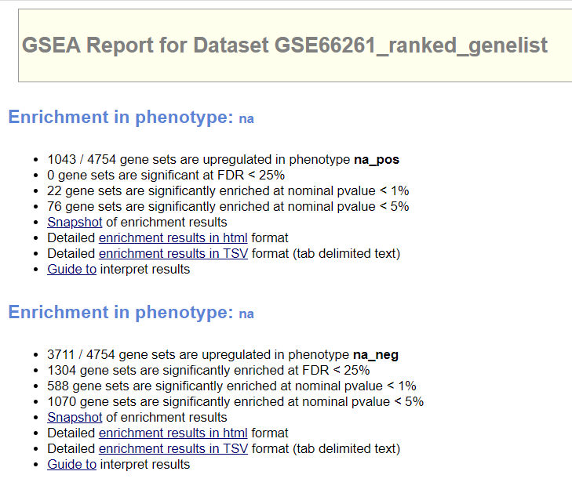

<br>

## 3. How do these results compare to the results from the thresholded analysis in Assignment #2. Compare qualitatively. Is this a straight forward comparison? Why or why not?
The thresholded analysis using g:Profiler on upregulated genes shows term names that are specific to metabolic and biosynthetic processes. Likewise, the top gene set in the positive phenotype for GSEA is related to metabolic process. However, the GSEA results also showed term names such as different types of development, morphogenesis, and cell differentiation as shown in Figure 2. This indicates that the results as a whole aren't similar.

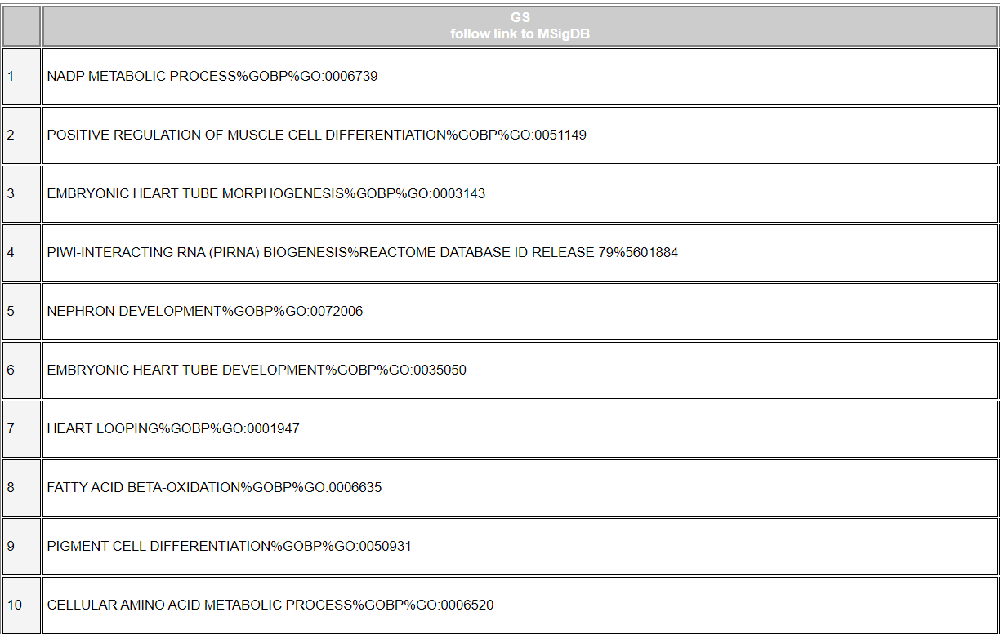

<br>

On the other hand, the thresholded analysis using g:Profiler on downregulated genes shows term names such as immune response and regulation as well as response to stimuli. Gene sets returned by GSEA for the negative phenotype are also enriched for terms related to immune response. However, the response types are more diverse such as interferon gamma and TNFA signalling as shown in Figure 3.

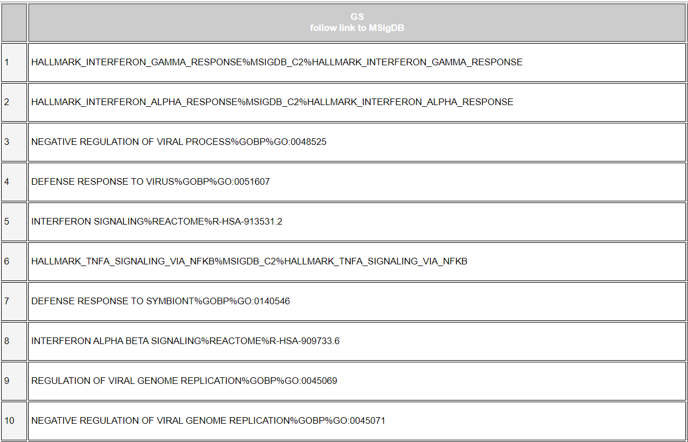

<br>

Despite some similarities between the g:Profiler results and GSEA results, this is not a straightforward comparison. This is because the thresholded analysis only looked at a subset of genes that were significant, while the non-thresholded analysis used all genes. This is evident in the terminology returned by GSEA, with a more diverse and unique set of term names to reflect all the genes.

<br>

# Visualization of Gene set Enrichment Analysis in Cytoscape
Cytoscape 3.9.1 was used with EnrichmentMap installed through the App Manager.

## 1. Create an enrichment map - how many nodes and how many edges in the resulting map? What thresholds were used to create this map? Make sure to record all thresholds. Include a screenshot of your network prior to manual layout.
An enrichment map was created by scanning the GSEA output folder for enrichment data. Through the "Analyze Network" tool, it is revealed that there are 651 nodes and 1639 edges as shown in Figure 4.

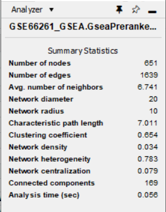
<br>

When creating the map, thresholds included a node cutoff of pval = 0.05, and an edge cutoff of pval = 0.375. As shown in Figure 5, all nodes are coloured blue, which indicates that only downregulated genes passed the threshold when mapping.

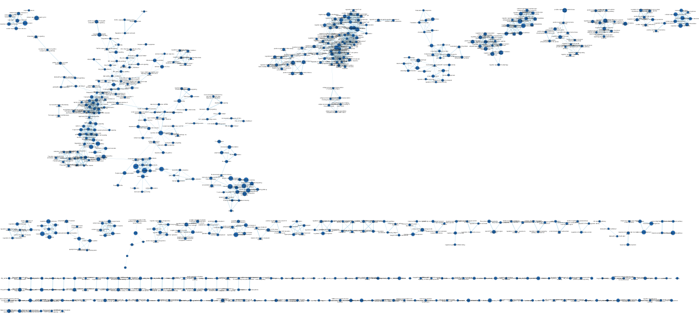

<br>

## 2. Annotate your network - what parameters did you use to annotate the network. If you are using the default parameters make sure to list them as well.
The network was annotated using the AutoAnnotate tool available in Cytoscape. The following parameters were used:

* Annotate entire network
* Use clusterMaker App
* Label column: GS_DESCR
* Cluster algorithm: MCL Cluster
* Edge weight column: similarity_coefficient

<br>

## 3. Make a publication ready figure - include this figure with proper legends in your notebook.
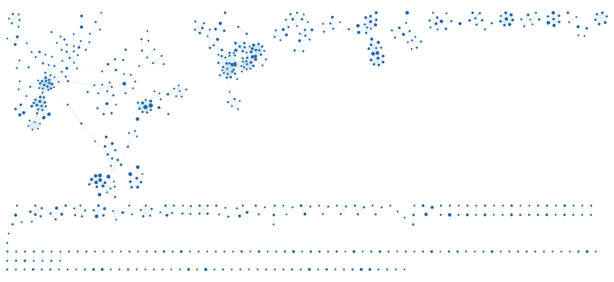

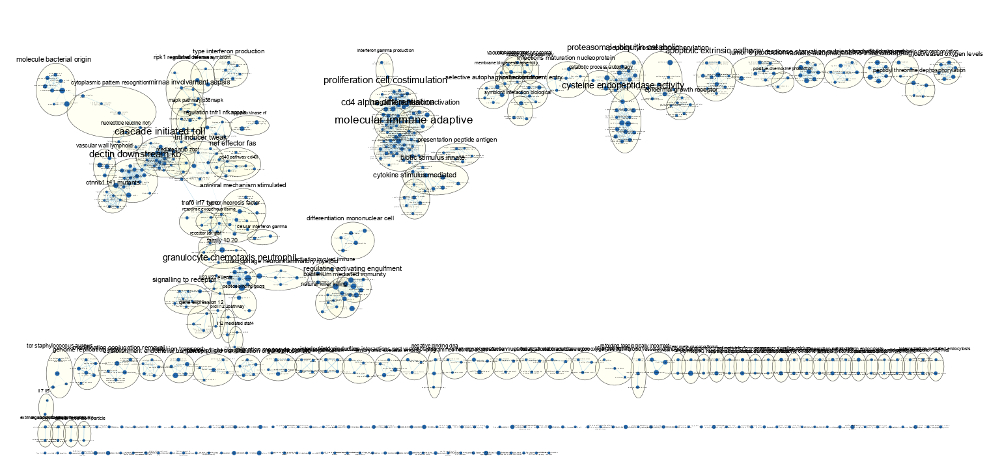

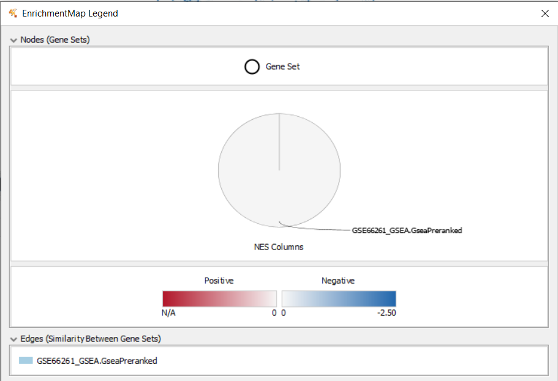

<br>

## 4. Collapse your network to a theme network. What are the major themes present in this analysis? Do they fit with the model? Are there any novel pathways or themes?

The network was collapsed to a theme network using AutoAnnotate's coSE Cluster Layout, as shown in Figure 9. Major themes are represented by large clusters of gene sets/nodes with a high number of connections/edges, with two being particularly relevant:

* Molecular immuno adaptive and cd4 alpha differentiation
* Cascade initiated toll and dectin downstream kb

<br>

Since all gene sets seem to contain downregulated genes only, both themes ultimately line up with the model and GSEA results as they are both implicated in immune response. However, the annotations reveal the specific themes that result in the immune response and allow for further investigation of their pathways.

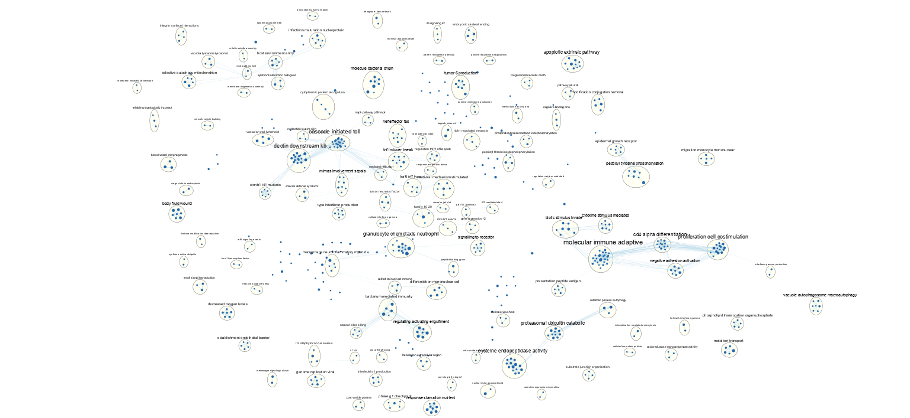

<br>

# Interpretation

## 1. Do the enrichment results support conclusions or mechanism discussed in the original paper? How do these results differ from the results you got from Assignment #2 thresholded methods?
The enrichment results do support the conclusions of the original paper. Specifically, the "Molecular immuno adaptive" and "cd4 alpha differentiation" annotations highlight the differentiation of naive T helper cells (also known as CD4+ T cells) into effector T helper subsets through TH1, TH2, and TH17 polarizing conditions. The paper mentions that this is a critical step for adaptive immune response to pathogens.

The enrichment results differ from the A2 results as the GSEA results and subsequent annotation provide more information than simply immune response, which is too general and broad. Rather, the second set of annotations "Cascade initiated toll" and "dectin downstream kb" specify the signalling pathways at play during the adaptive immune response.

<br>

## 2. Can you find evidence, i.e. publications, to support some of the results that you see. How does this evidence support your result?
Yes, the paper "Toll-like receptor 4 signaling in T cells promotes autoimmune inflammation" by Reynolds et al. specifies that TLR4 is expressed in CD4+ T cells. In addition, the paper "Dectin-1 Signaling Update: New Perspectives for Trained Immunity" by Mata-Martinez et al. states that Dectin-1 signalling ignites the differentiation of naive CD4+ T cells to a TH1 or TH17 phenotype.

<br>

## 3. Transcription factors post analysis

A post analysis to the network was done to analyze 4 transcription factors which were determined to be key for governing cell fate decisions according to the paper. Specifically, they play a role in the selective activation and silencing of genes encoding lineage specific cytokines. The transcription factors are:

* T-bet/TBX21 for TH1 condition
* GATA3 for TH2 condition
* ROR-γt/RORC and BATF for TH17 condition


The MSigDB human transcription factors file from download.baderlab.org (Human_TranscriptionFactors_MSigdb_April_01_2022_symbol.gmt) was initially used. It was then filtered to only include gene sets containing one of the 4 transcription factors mentioned. This code is provided in the journal entry associated with this assignment. The filtered signature gene set contains 99 gene sets in total, which was fed into Enrichment Map. A Mann-Whitley two-sided test was implemented for the post analysis. A cutoff of 0.0001 was used to limit the number of gene sets analyzed and to improve runtime. This led to 10 gene sets being fed into the analysis, as shown in Figure 10.

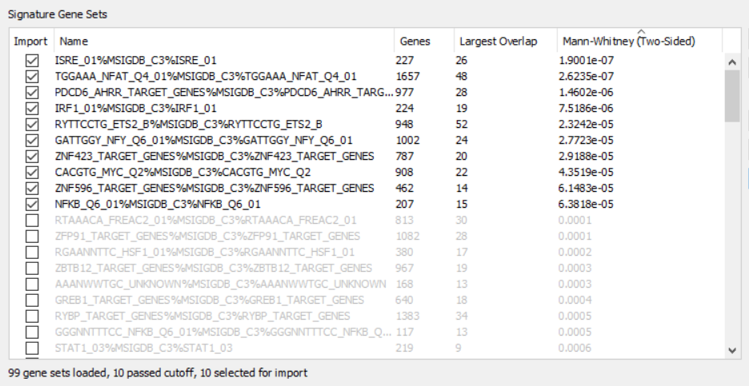

<br>

Looking at a zoomed image of the annotated enrichment map after post analysis, we see that TGGAAA_NFAT_Q4_01 is highly associated with the two main clusters of molecular immuno adaptive and cascade initiated toll. Upon further search, the paper "NFAT, immunity and cancer: a transcription factor comes of age" by Martin R. Müller & Anjana Rao reveals that the class of NFAT transcription factors are of primary importance during T cell activation and differentiation. However, the paper fails to mention the expression of NFAT when exposed to TH1, TH2, and TH17 conditions. Thus, there should be a follow up with the authors of the paper by revealing the results of the post analysis and asking whether NFAT was examined in detail.

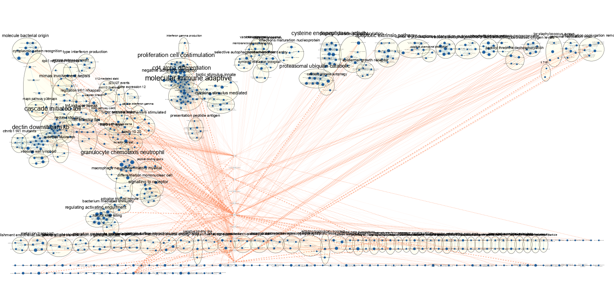

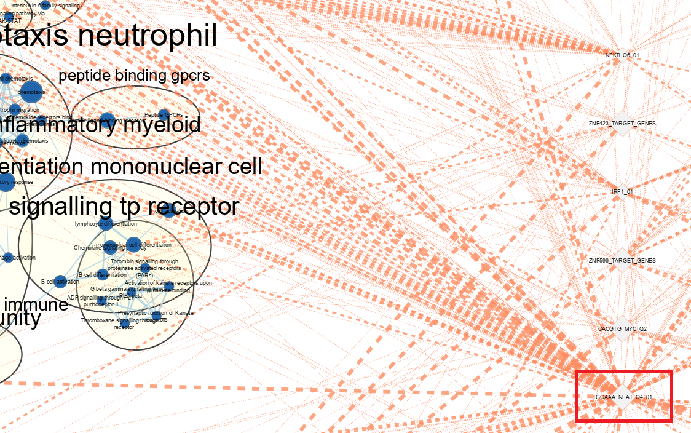 

<br><br>

# References